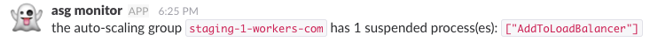

# travis-asg-monitor

monitor aws auto-scaling groups for suspended processes (usually instance termination) and post a message to slack.



## install

create a heroku app and add the required buildpacks:

```
heroku buildpacks:add https://github.com/heroku/heroku-buildpack-apt
heroku buildpacks:add heroku/python
```

create the scheduler add-on:

```
heroku addons:create scheduler:standard
```

configure `monitor` to run hourly:

```
heroku addons:open scheduler
```

then create an IAM user with `autoscaling:DescribeAutoScalingGroups` permission (see `iam-policy.json` for an example policy).

then add an app of type "incoming webhook" to the slack channel you wish to post to.

configure the environment variables needed:

```
AWS_ACCESS_KEY_ID=...
AWS_SECRET_ACCESS_KEY=...
AWS_DEFAULT_REGION=us-east-1

ASG_NAMES="production-2-workers-org production-2-workers-com"

SLACK_WEBHOOK_URL=...
```

finally, verify that everything is working:

```
heroku run monitor
```
